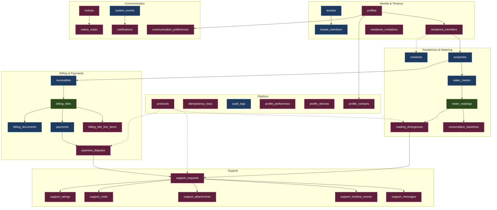
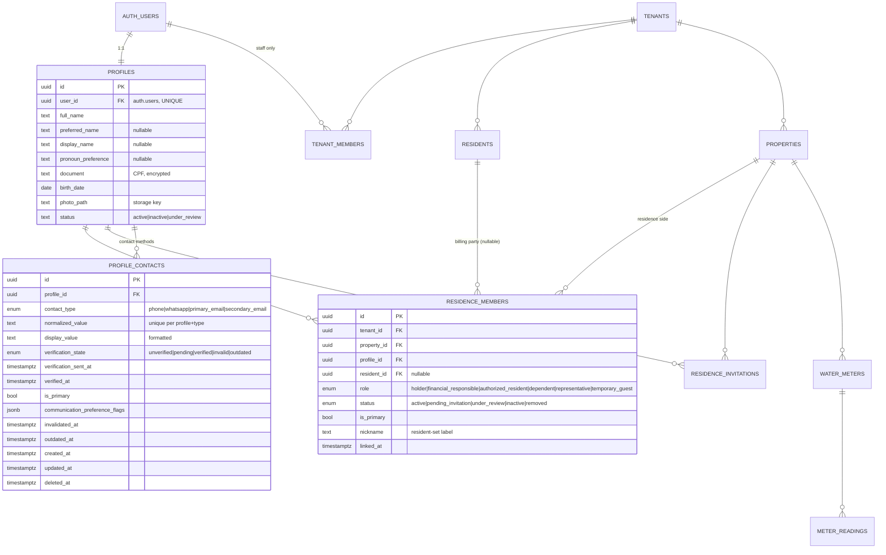

# 02 — Domain Model, ERD & Entity Catalog

> Deliverables 2 (ERD) and 3 (Entity Catalog).
> Legend: **`existing`** = live today, unchanged · **`extend`** = additive columns only · **`new`** = proposed

**July 19, 2026 implementation update:** the local Sprint 1 schema implements the identity-and-tenancy subset of this model with `profiles`, `profile_contacts`, `tenants`, `properties`, `platform_role_assignments`, `tenant_members`, `residence_members`, `profile_preferences`, `profile_devices`, and `audit_events`. Invitation, storage, finance, consumption, and support production entities remain outside Sprint 1 scope.

---

## 1. Bounded contexts

Blue = existing · Green = extended · Pink = new.

---

## 2. Core ERD — identity and residence linkage

This is the part that does not exist today and that everything authenticated depends on (ADR-01).

### Why `residence_members` carries `tenant_id` despite being derivable

`tenant_id` is derivable through `property_id`. It is stored anyway, denormalized, because:

1. Every RLS policy and every Edge Function tenant filter can then be a single-column predicate
   rather than a join — this table sits on the hot path of *every* resident request.
2. The Connect guardrails mandate `tenant_id` never be absent from queries, contexts, policies,
   or functions.
3. A composite FK `(tenant_id, property_id) → properties(tenant_id, id)` makes the denormalization
   **impossible to corrupt** rather than merely conventional.

The same pattern applies to every new tenant-scoped table below.

---

## 3. Entity catalog

### 3.1 Identity & Tenancy

#### `profiles` — **new**
Platform-level identity. One row per `auth.users`. **Not tenant-scoped** — a person may hold
residences across multiple associations.

| Column | Type | Notes |
|---|---|---|
| `id` | uuid PK | |
| `user_id` | uuid UNIQUE NOT NULL → `auth.users` | ON DELETE RESTRICT — never orphan billing history |
| `full_name` | text NOT NULL | legal name; protected field, correction-request only |
| `preferred_name` | text | resident-editable |
| `display_name` | text | resident-editable |
| `pronoun_preference` | text | resident-editable |
| `document` | text | CPF. Encrypted at rest; API returns masked only |
| `birth_date` | date | protected field |
| `photo_path` | text | storage object key, not a URL |
| `status` | enum | `active \| inactive \| under_review` |
| `created_at` / `updated_at` / `deleted_at` | timestamptz | soft delete |

Serves: `ResidentProfile`, `EditableProfileFields`, `ProtectedProfileField[]`.

**Protected vs editable is a server-enforced split.** `fullName`, `cpf`, `birthDate`, `role` are
rejected by the profile-update endpoint and must flow through a correction request that issues a
protocol. The UX already renders this distinction (`CorrecaoPage.tsx`); the server must be its
source of truth, not the form.

#### `profile_contacts` — **new**

Contact methods for a profile, with verification lifecycle. Owned by `profiles`; not tenant-scoped
because a person may reuse a contact across associations.

| Column | Type | Notes |
|---|---|---|
| `id` | uuid PK | |
| `profile_id` | uuid NOT NULL → `profiles(id)` | cascade delete on profile erasure |
| `contact_type` | enum | `phone \| whatsapp \| primary_email \| secondary_email` |
| `normalized_value` | text NOT NULL | lowercased email / E.164 phone; used for uniqueness and verification matching |
| `display_value` | text | formatted value shown to the user |
| `verification_state` | enum | `unverified \| pending \| verified \| invalid \| outdated` |
| `verification_token_hash` | text | one-time code hash; null when not pending |
| `verification_sent_at` | timestamptz | rate-limiting and TTL enforcement |
| `verified_at` | timestamptz | null until verified |
| `is_primary` | boolean | one primary per `contact_type` per profile |
| `communication_preference_flags` | jsonb | per-channel opt-in flags |
| `invalidated_at` | timestamptz | soft-marked invalid |
| `outdated_at` | timestamptz | soft-marked outdated (resident report) |
| `created_at` / `updated_at` | timestamptz | standard |
| `deleted_at` | timestamptz | soft delete |

**Constraints and indexes**

- `UNIQUE (profile_id, contact_type, normalized_value) WHERE deleted_at IS NULL`
- `UNIQUE (profile_id, contact_type) WHERE is_primary = true AND deleted_at IS NULL`
- Partial index `(normalized_value) WHERE verification_state = 'verified'` — supports first-access lookup
- Index on `(profile_id, contact_type, deleted_at)`

**Verification state model**

| State | Meaning | Transitions |
|---|---|---|
| `unverified` | Record created, never verified | → `pending` |
| `pending` | Verification code sent, awaiting confirmation | → `verified`, `invalid` |
| `verified` | Code confirmed or association-onboarded | → `outdated` |
| `invalid` | Bounced email, unreachable phone, or failed confirmation | → `pending` (after fix) |
| `outdated` | Resident reported the contact is no longer current | → `pending` (new value) |

**Uniqueness across profiles:** a normalized email or phone may be shared across profiles. The first
verified record is authoritative for login resolution; subsequent verified records for the same value
require additional proof-of-control during first access.

Serves: `ContactMethod[]`, `ContactInfo`, `performContactEdit`, `performContactVerification`.

#### `residence_members` — **new**
The resident authorization primitive. See ERD above.

Constraints:
- `UNIQUE (property_id, profile_id)` — one edge per person per residence
- `UNIQUE (profile_id) WHERE is_primary` — at most one primary residence per person
- Composite FK `(tenant_id, property_id)` → `properties (tenant_id, id)`
- Partial index `(profile_id) WHERE status = 'active'` — the hot lookup on every request

Serves: `LinkedResidenceItem[]`, `LinkedResident[]`, `ResidenceContext[]`, and **every
authorization check in the Resident App**.

#### `residence_invitations` — **new**

| Column | Notes |
|---|---|
| `tenant_id`, `property_id` | scope |
| `invitee_profile_id` (nullable) / `invitee_document` / `invitee_email` | invite before signup |
| `inviter_profile_id` (nullable) / `inviter_type` | `resident \| association` |
| `proposed_role` | resident_role enum |
| `status` | `pending \| accepted \| declined \| expired \| revoked` |
| `expires_at` | NOT NULL — the UX renders expiry |
| `token_hash` | for link-based acceptance; never store the raw token |

Serves: `ResidenceInvitation`, `performAcceptInvitation`, `performDeclineInvitation`.

#### `tenant_members` — **extend**
Add `collector` to the role CHECK for the Collector App. **Do not add `resident`** (ADR-01).

#### `tenants`, `residents`, `properties` — **existing, unchanged**
`properties` gains no columns; the resident-facing `nickname` lives on `residence_members`
because it is a per-person label, not a property attribute. Two residents may nickname the same
residence differently — the UX permits this and the model should not fight it.

---

### 3.2 Residences & Metering

#### `meter_readings` — **extend**
Existing columns are sound. Additive, and shared with the Collector App:

| Column | Purpose |
|---|---|
| `collector_id` → `tenant_members` | who took it — absent today |
| `previous_reading_value` numeric | **server-derived**, closing audit HIGH-02 |
| `idempotency_key` text | UNIQUE per tenant — closes duplicate-reading risk |
| `client_reading_id` uuid | offline client-generated ID |
| `status` enum | `registered \| estimated \| revised \| pending \| not_performed \| under_review` |
| `origin` enum | `field_collection \| remote \| resident_reported \| estimated \| imported` |
| `photo_path` text | storage key |
| `anomaly_flags` jsonb | populated by classification |

`status` and `origin` map directly to `HistoricalDataPoint.status` / `readingOrigin`. Today
`reading_type` is only `manual | automatic` — insufficient for the six states the UX renders.

**Critical correction:** consumption must be computed server-side from the previous reading
*that the server looks up*. Today `meter-readings-api` trusts a client-supplied
`previous_reading` (verified, `index.ts:104-107`). That is a financial-integrity defect: the value
feeds billing.

#### `consumption_baselines` — **new**
Per-meter rolling statistics enabling `usualRange`, `classification`, and alerts without
recomputing history per request.

| Column | Notes |
|---|---|
| `water_meter_id` FK, `tenant_id` | scope |
| `period_months` smallint | window (e.g. 6) |
| `avg_consumption`, `stddev`, `min_usual`, `max_usual` | numeric |
| `computed_at` | recomputed after each accepted reading |

Serves `CurrentPeriodSummary.usualRange` and `ConsumptionClassification`.
**Classification thresholds are business rules and live in the Edge Function, not the client** —
the client must never be able to recompute or contest a classification.

#### `reading_divergences` — **new**
The resident's "I don't recognise this consumption" flow (`DivergenceFlow.tsx`).

`meter_reading_id`, `profile_id`, `reason` (6-value enum from `DivergenceReason`), `description`,
`attachment_path`, `protocol_id` → `protocols`, `support_request_id` (nullable), `status`.

**A divergence opens a support request.** The UX shows the resident a protocol and then tracks it
in `/atendimento`. Modelling divergence as a first-class entity *linked to* a support request —
rather than only as a support request — preserves the consumption-domain analytics (how many
divergences per meter, per period) that the association will need.

---

### 3.3 Billing & Payments

#### `billing_titles` — **extend**
| Column | Purpose |
|---|---|
| `replaced_by_id` uuid self-FK | supersession chain (`isReplaced`, `replacedById`, `replacesId`) |
| `under_review_at` timestamptz | supports `under_review` status the UX renders |

Add `UNIQUE (receivable_id)` — closes audit LOW-03 (duplicate-title race under concurrency).

#### `billing_title_line_items` — **new**
| Column | Notes |
|---|---|
| `billing_title_id` FK, `tenant_id` | scope |
| `description` text | **content, not a label** — association-authored, returned as-is |
| `amount_cents` bigint | integer minor units (ADR-03) |
| `item_type` enum | `water \| maintenance \| reserve \| adjustment \| discount \| interest \| fine \| other` |
| `sort_order` smallint | UX renders in order |

Serves `InvoiceLineItem[]`. **Invariant:** `SUM(amount_cents) = billing_titles.amount`, enforced
by a deferred constraint trigger. A resident seeing line items that don't sum to their total is a
trust-destroying defect in a financial app.

#### `payment_disputes` — **new**
The "I already paid this" flow (`UnrecognizedPaymentFlow.tsx`).

`billing_title_id`, `profile_id`, `reason` (5-value enum from `UnrecognizedReason`),
`payment_date`, `payment_method`, `transaction_reference`, `attachment_path`, `protocol_id`,
`support_request_id`, `status`.

#### `receivables`, `payments`, `billing_documents` — **existing, unchanged**
Read-only from the Resident App's perspective. `ReceiptData` is assembled from
`payments + billing_titles + profiles + tenants`.

---

### 3.4 Communication — all new

#### `notifications`
Per-recipient inbox. One row per profile per event — **not** a shared row with a read-state join.
Fan-out on write is correct here: reads vastly outnumber writes, and per-recipient rows make
`unreadCount` a single indexed count rather than an anti-join.

| Column | Notes |
|---|---|
| `tenant_id`, `profile_id` | scope + recipient |
| `category` enum | `invoice \| payment \| consumption \| support \| notice \| profile \| document` |
| `priority` enum | `info \| important \| urgent` |
| `title_key`, `body_key` text | **i18n keys, not text** (ADR-03) |
| `params` jsonb | interpolation values (amounts as minor units, dates as ISO) |
| `destination_type` enum, `destination_entity_id` uuid | canonical — assembler derives the path |
| `related_residence_id` uuid | nullable; UX shows which residence |
| `read_at` timestamptz | null = unread |
| `system_event_id` FK | provenance |

Index: `(profile_id, read_at) WHERE read_at IS NULL`, `(profile_id, created_at DESC)`.

**On `title_key`/`params` rather than rendered text:** a notification generated in June must still
render correctly if the resident switches to English in December. Storing rendered Portuguese
would freeze language at write time — for a SaaS platform, permanently.

#### `notices`
Association-authored broadcast.

`category` (7-value), `priority`, `title`, `summary`, `content` (**content, not labels** — authored
prose, returned as-is), `published_at`, `validity_end`, `audience` (`all_residences |
specific_residence | multiple_residences`), `contact_phone`, `contact_email`,
`attachments` → storage.

`notice_targets` (notice_id, property_id) resolves the audience for the two targeted modes.

#### `notice_reads`
`(notice_id, profile_id, read_at)` — per-person read state on shared content.

#### `communication_preferences`
`(profile_id, category, channel, enabled)` plus a `mandatory` flag with `mandatory_reason_key`.

The UX renders mandatory categories as non-disableable with an explanation. **The server must
reject attempts to disable them** — a disabled toggle in the DOM is not a control.

---

### 3.5 Support — all new

#### `support_requests`
| Column | Notes |
|---|---|
| `tenant_id`, `property_id`, `profile_id` | scope + author |
| `protocol_id` FK → `protocols` | the resident's reference |
| `category` enum | 10 values from `SupportRequestCategory` |
| `status` enum | 12 values from `SupportRequestStatus` |
| `priority` enum | `normal \| important \| urgent` |
| `subject`, `description` | resident content |
| `related_entity_type` / `related_entity_id` | polymorphic link to invoice/payment/reading/notice/residence |
| `responsible_area` | association-side routing |
| `occurrence_date`, `contact_channel`, `preferred_time` | intake fields |
| `closed_at`, `reopened_at`, `reopen_count` | lifecycle |

Index: `(tenant_id, profile_id, status)`, `(tenant_id, property_id, created_at DESC)`.

`statusExplanation`, `expectedNextStep`, `eligibleActions[]`, `hasUnreadMessages` are **derived,
not stored** — computed per request from status, role, visit state, and message read markers.

#### `support_messages`
`sender_type` (`resident | association | system`), `sender_profile_id` / `sender_member_id`,
`content`, `requires_reply` bool, `read_at`, `attachment_id`.

Realtime-enabled (Doc 05).

#### `support_timeline_events`
Append-only, immutable. `actor_type`, `actor_name`, `event_type`, `title_key`, `params`,
`status_change`, `attachment_id`.

**Immutable by design:** no UPDATE/DELETE policy, ever. The timeline is the audit trail the
resident sees; it must be as trustworthy as `audit_logs`.

#### `support_visits`
`proposed_date`, `time_window`, `purpose`, `preparation_instructions_key`, `contact_person`,
`contact_phone`, `status` (`proposed | confirmed | rescheduled | canceled | completed`),
`confirmed_at`, `confirmed_by_profile_id`.

#### `support_ratings`
`(support_request_id UNIQUE, score 1-5 CHECK, comment, submitted_at)`. One rating per request.

#### `support_attachments`
`storage_path`, `file_name`, `mime_type`, `size_bytes`, `attachment_type`
(`photo | receipt | document | meter_image | other`), `uploaded_by_profile_id`, `virus_scan_status`.

---

### 3.6 Platform — all new

#### `protocols`
| Column | Notes |
|---|---|
| `tenant_id`, `type` enum (`SUP\|DIV\|PAG\|COR`), `sequence` bigint | |
| `formatted` text | e.g. `SUP-2026-000142` — generated, stored, immutable |
| `entity_type`, `entity_id` | back-reference |

`UNIQUE (tenant_id, type, sequence)`. Issued via a dedicated sequence per tenant+type so
concurrent requests cannot collide.

#### `idempotency_keys`
`(tenant_id, key, endpoint)` UNIQUE, `request_hash`, `response_snapshot` jsonb, `status`,
`created_at`, `expires_at` (24h TTL, reaped). See ADR-08.

#### `profile_preferences`
App and accessibility preferences (`AppPreference[]`, `AccessibilityPreference[]`): initial screen,
default residence, list density, show values on home, residence-change confirmation, session lock,
language, date format, high contrast, reduced motion, larger text.

Stored server-side, **not** in localStorage, because the UX promises them across devices and the
`/perfil/acessibilidade` screen presents them as account settings.

#### `profile_devices`
Serves `SimulatedSession[]` on `/perfil/seguranca`: `device_name`, `device_type`, `last_access`,
`auth_method`, `is_trusted`, `location`, `revoked_at`.

**Honest scoping note:** Supabase GoTrue does not expose a per-session device registry. This table
records device metadata that the app itself reports at sign-in, and revocation here must be paired
with a GoTrue global sign-out. It is therefore *approximate* — "sign out other devices" can be
honoured globally but per-device revocation cannot be guaranteed without a custom session layer.
This limitation should be accepted explicitly or the UX adjusted; it must not be silently rendered
as more precise than it is.

#### `audit_logs`, `system_events` — **existing**
`audit_logs` has 0 rows and is called by one undeployed function. Adoption across all functions is
mandatory in the new work (guardrail: "audit trails for all sensitive operations").

---

## 4. Conventions applied to every new table

| Concern | Standard |
|---|---|
| PK | `uuid PRIMARY KEY DEFAULT gen_random_uuid()` — matches all 26 existing tables |
| Tenancy | `tenant_id uuid NOT NULL REFERENCES tenants(id)`; composite FKs where a parent is also tenant-scoped |
| Timestamps | `created_at`, `updated_at` timestamptz NOT NULL DEFAULT now(); reuse existing `update_updated_at_column()` trigger |
| Soft delete | `deleted_at timestamptz NULL`; all reads filter it; partial unique indexes use `WHERE deleted_at IS NULL` |
| Audit fields | `created_by`, `updated_by` → `profiles` or `tenant_members` on mutable business entities |
| Money | `bigint` minor units. **Never `float`.** Existing `numeric(14,2)` columns are left as-is; new columns are `_cents` |
| Enums | Postgres enum types, matching frontend string unions exactly, verbatim |
| RLS | Enabled on creation. No table ships without a policy (Doc 04) |
| Indexes | Every FK indexed; composite indexes on the documented access paths |
| Naming | `snake_case`, plural tables — consistent with the existing 26 |

---

## 5. Frontend type → backend source map

Traceability for every major type in `src/fixtures/types.ts`.

| Frontend type | Backed by | Gap |
|---|---|---|
| `ResidentProfile` | `profiles` | **new** |
| `EditableProfileFields` | `profiles` (3 columns) | **new** |
| `ProtectedProfileField[]` | `profiles` + correction requests | **new** |
| `ContactMethod[]` / `ContactInfo` | `profile_contacts` (**new**) + verification state | **new** |
| `LinkedResidenceItem[]` | `residence_members` + `properties` + `tenants` | **new** |
| `LinkedResident[]` | `residence_members` + `profiles` | **new** |
| `ResidenceInvitation` | `residence_invitations` | **new** |
| `ResidenceContext` / `ResidenceDetail` | `properties` + `residence_members` | partial |
| `WaterServiceInfo` | `water_meters` + latest `meter_readings` | partial |
| `AssociationInfo` | `tenants` (+ `settings` jsonb) | partial |
| `ConsumptionOverview` | `meter_readings` + `consumption_baselines` + rules | partial |
| `CurrentPeriodSummary` | derived in Edge Function | rules **new** |
| `HistoricalDataPoint[]` | `meter_readings` (extended) | extend |
| `ConsumptionInsight[]` / `ConsumptionAlert[]` | rules engine + `system_events` | **new** |
| `EducationCard[]` | static i18n content — **no backend** | n/a |
| `FinancialOverview` | `billing_titles` + `payments` aggregate | assemble |
| `InvoiceData` | `billing_titles` + `receivables` + line items | extend |
| `InvoiceLineItem[]` | `billing_title_line_items` | **new** |
| `BoletoInfo` / `PixInfo` | `billing_titles` (barcode, digitable_line, pix_*) | existing |
| `PaymentRecord[]` / `ReceiptData` | `payments` | existing |
| `NotificationItem[]` | `notifications` | **new** |
| `NoticeItem[]` | `notices` + `notice_reads` + `notice_targets` | **new** |
| `CommunicationPreference[]` | `communication_preferences` | **new** |
| `SupportRequest` | `support_requests` + 5 child tables | **new** |
| `FAQItem[]` / `AssociationContactInfo` | `tenants.settings` or static i18n | partial |
| `AppPreference[]` / `AccessibilityPreference[]` | `profile_preferences` | **new** |
| `SecurityInfo` / `SimulatedSession[]` | `profile_devices` + GoTrue | **new** (approximate) |
| `PrivacySection[]` / `AboutInfo` | static i18n content — **no backend** | n/a |

Three types are deliberately **not** backend-backed: `EducationCard`, `PrivacySection`, and
`AboutInfo` are editorial content. Routing them through the database would add deploy latency and
a migration to every copy edit, for no benefit. They stay in i18n resources.

---

**Next:** [03 — API & Edge Function Catalog](03-api-and-edge-functions.md)
